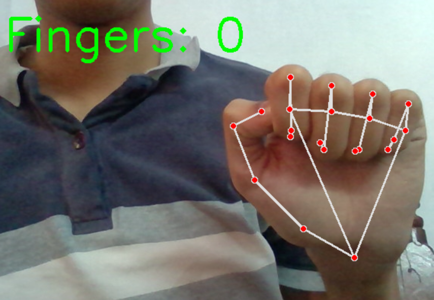
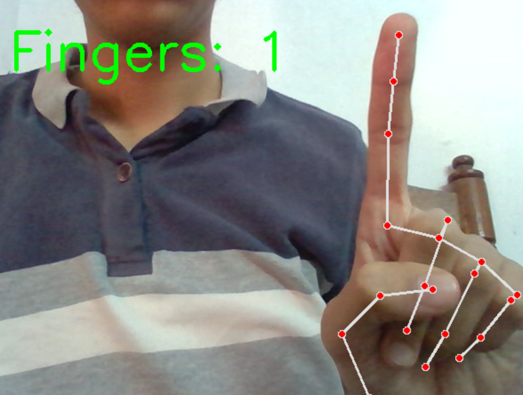
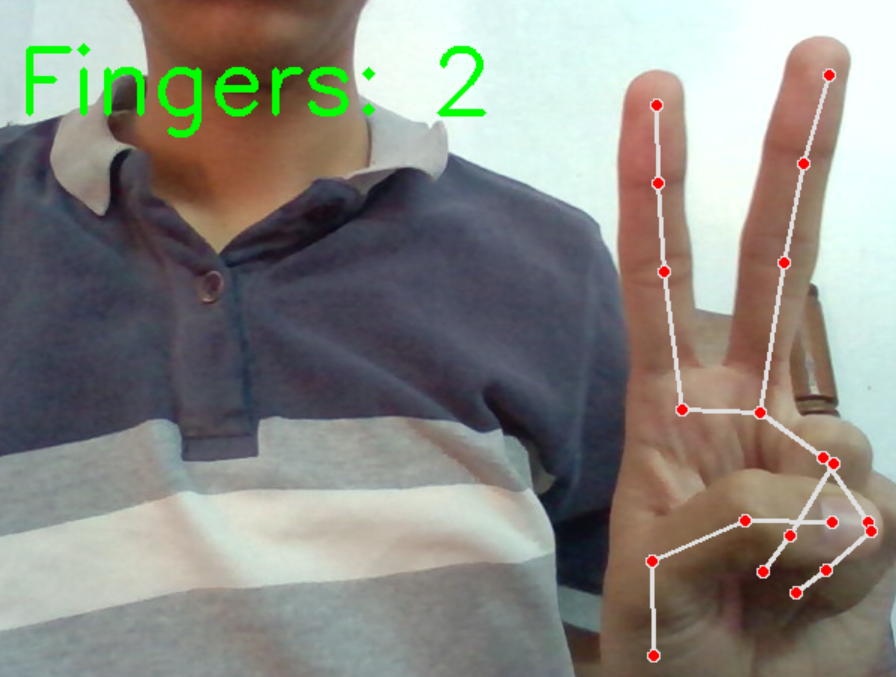
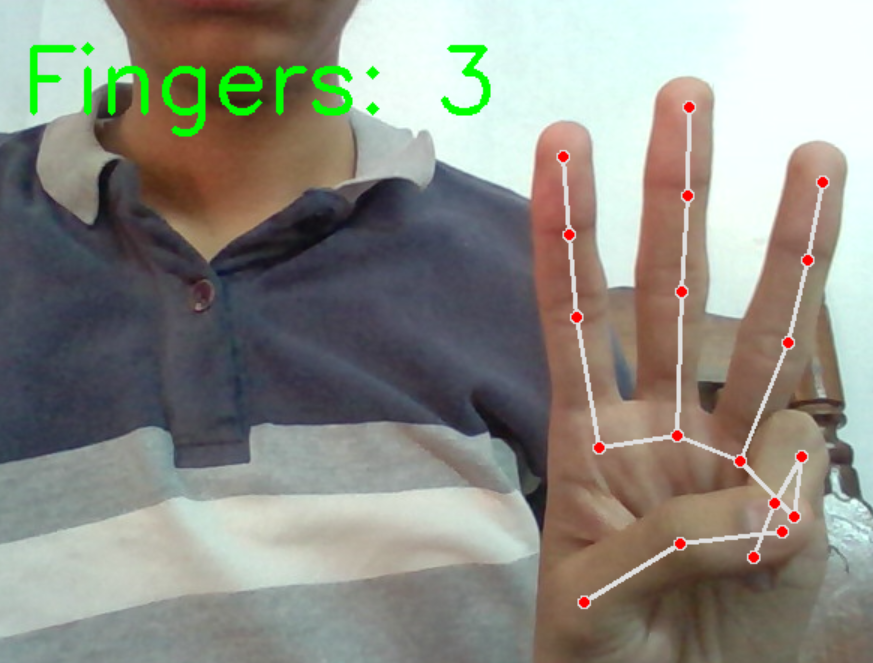
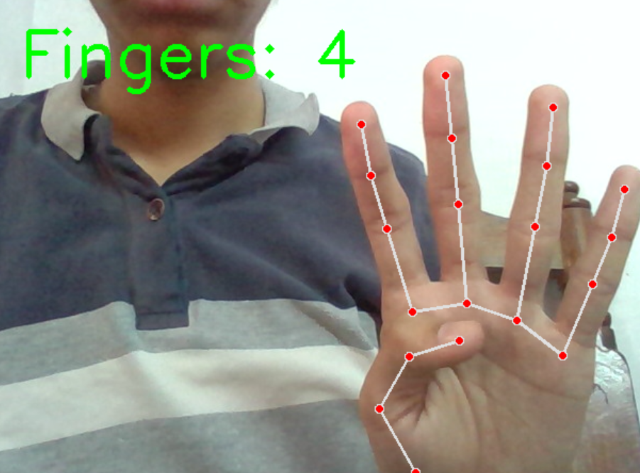
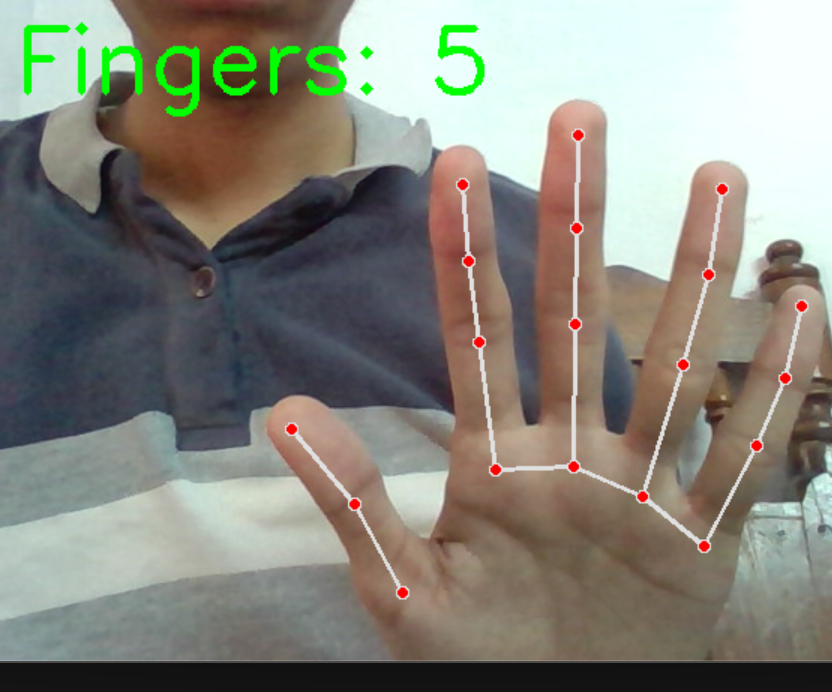

# Hand Gesture Finger Counter (0–5) using OpenCV and MediaPipe

A computer vision project that detects a hand using **MediaPipe** and counts the number of raised fingers **from 0 to 5 in real time** using **OpenCV and Python**.

The system tracks **21 hand landmarks** and determines whether each finger is open or closed to calculate the total number of raised fingers.

---

## Features

* Real-time hand detection using webcam
* 21 hand landmark tracking using MediaPipe
* Finger state detection (open / closed)
* Finger counting from **0 to 5**
* Live display of detected finger count

---

## Technologies Used

* Python
* OpenCV
* MediaPipe
* Computer Vision

---

## Project Structure

Gesture_Count_0_to_5
│
├── gesture_count_upto_5.py
├── requirements.txt
├── README.md
└── Output_Screenshots
  ├── finger_count_0.png
  ├── finger_count_1.png
  ├── finger_count_2.png
  ├── finger_count_3.png
  ├── finger_count_4.png
  └── finger_count_5.png

---

## How It Works

1. The webcam captures real-time video frames.
2. MediaPipe detects the hand in the frame.
3. The system extracts **21 landmark points** of the hand.
4. Finger positions are analyzed to determine whether they are open or closed.
5. The program counts the number of raised fingers and displays the result on the screen.

---

## Output Examples

### Finger Count = 0

### Finger Count = 1

### Finger Count = 2

### Finger Count = 3

### Finger Count = 4

### Finger Count = 5

---

## Installation

Install required dependencies:

pip install -r requirements.txt

---

## Run the Project

python gesture_count_upto_5.py

Press **ESC** to exit the program.

---

## Applications

* Gesture-based human computer interaction
* Touchless control systems
* Robotics control interfaces
* Computer vision learning projects

---

## Future Improvements

* Gesture recognition (Peace, Stop, Thumbs Up)
* Gesture-based command systems
* Accuracy measurement for gesture detection
* Integration with smart devices
